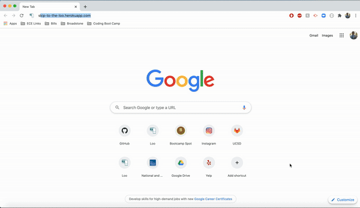
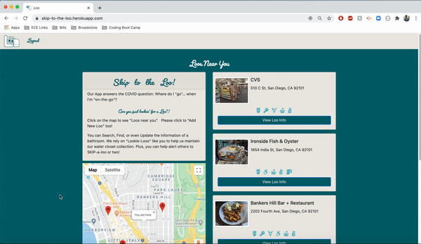

# Skip To The Loo: A Public Restroom Mapper
               [](https://github.com/ellerbrock/open-source-badges/)


## Description
Skip To The Loo is a full-stack application that identifies nearby public restrooms in times of need, especially relevant during the era of COVID-19. Functioning as a user-driven 'Loo' logger, Skip To The Loo was created using Node, Express, Handlebars, a Sequelize ORM, MySQL for our database, and renders all the pertinent information with a Google Places API. It follows the MVC deisgn paradigm where Node & MySQL query the route data and Handlebars generates the HTML for the user to view. For validation, code consistency, and testing of our app both ESLint & Travis CI were used. 

The app is currently deployed on Heroku so you can check out [Skip To The Loo](https://skip-to-the-loo.herokuapp.com/) now!


## Table of Contents 

* [Demo](#demo)

* [Prerequisites](#prerequisites)

* [Installation](#installation)

* [Usage](#usage)

* [License](#license)

* [Collaborators](#collaborators)

* [Contributing](#contributing)
​
* [Questions](#questions)

## Demo

Skip to the Loo live on [Heroku!](https://skip-to-the-loo.herokuapp.com/)

### Logging In, Adding Loo, Logging Out


### Updating Loo Info


## Prerequisites

Should you want to create your own replica of the application, you'll need to have the following technologies and resources installed:

* [Node.js](https://nodejs.dev/)
* [MySQL and MySQL Workbench](https://dev.mysql.com/downloads/mysql)
* [Google Places API](https://developers.google.com/maps/premium/apikey/places-apikey)
* [Heroku](https://dashboard.heroku.com/)

## Installation

To review the repository of the project, you can clone the repo remotely with the following command line in your terminal

```
git clone https://github.com/alexastef/loo.git
```

If you'd like to install the app locally, you can navigate to the 'loo' directory and then follow the next steps:

Install the necessary and relevant dependencies using Node.js by running the following command:

```
npm install
```

You can then run the following command below, then go to your browser and enter: ```https://localhost:8080```

```
node server.js
```

## Usage

Whether you've accessed the app locally on your browser or if you went directly from the Heroku link, you'll be directed to the home page where you're presented with an embedded Google Maps area based on your current location and an option to "Add New Loo." If you click on the "Add New Loo" button you'll be prompted first to either sign up or log into the app. 

After doing so, you're given results of places based off of your current location or any keyterm you input on the search bar that you can either add into your collection or edit loo info for those respective places. 

As a user, you will be provided with some additional information about the 'loo' such as 

* Details Provided
  * Address & Contact Information
  * Time Stamp from last verfied & updated

You're also given the option to update the following critical details for the loo

* Basic Essentials
  * Availability
  * Needs a Key
  * Gender Neutral
  * ADA-Compliant/Accessible

* Supplies Information
  * Sink
  * Soap
  * Toilet Paper
  * Mirror
* Overall Cleanliness Rating


You then begin to add public restrooms with relevant info to your collection that are saved to your account so that you may look back and reference for the next time you or others are on the go and need to Skip To The Loo!

## License

This project is licensed under the MIT license.

## Collaborators

### 
* ### [Johnny Li](https://github.com/reptile18)
### 
* ### [Matt Moncayo](https://github.com/mmoncayo)
### 
* ### [Erin Smith](https://github.com/erin-smith)
### 
* ### [Alexa Stefankiewicz](https://github.com/alexastef)

## Contributing

If you'd like to contribute to the repo, there is interest in future development in major areas for an easier UI experience, connectivity across social media platforms, etc.

If interested in contributing, please reach out to any of the collaborators via GitHub to discuss your input.

## Questions

Questions or feedback-- we welcome them all! Feel free to reach out for any questions about the repo, open an issue or contact any of the collaborators above and we'll get back to you as soon as possible.
